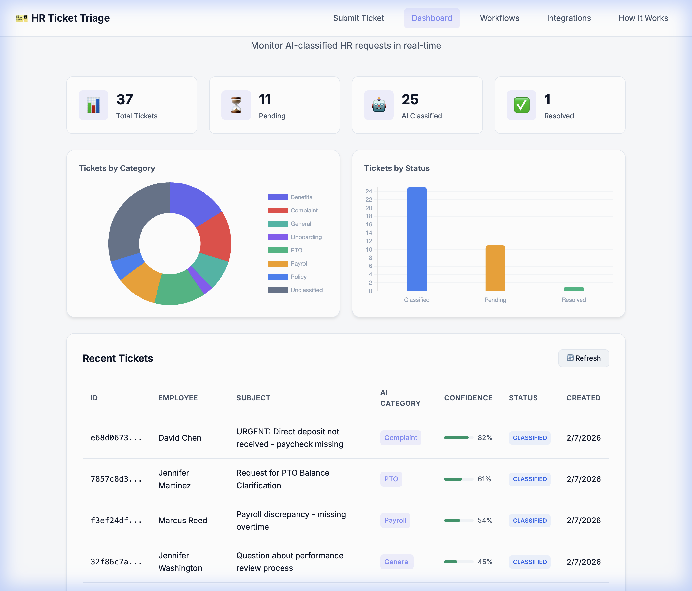

# 🎫 HR Ticket Triage & Auto-Resolution System

An AI-powered HR ticketing system that automatically classifies, routes, and responds to employee requests using **n8n workflow automation**, **HuggingFace zero-shot classification**, and real-time integrations with **Slack** and **Google Sheets**.


---

## 🎯 Overview

This Proof of Concept demonstrates a complete **AI Operations** workflow that:

- **Automatically classifies** HR tickets into 8 categories using zero-shot NLP
- **Routes tickets** to appropriate teams via Slack notifications
- **Logs all activity** to Google Sheets for tracking and analytics
- **Generates AI-suggested responses** based on ticket category
- **Provides real-time analytics** through an interactive dashboard

### Key Features

| Feature | Description |
|---------|-------------|
| 🤖 **AI Classification** | HuggingFace zero-shot model categorizes tickets with confidence scores |
| 📊 **Real-time Dashboard** | Monitor tickets, categories, and resolution status |
| 💬 **Slack Integration** | Instant notifications to HR team channels |
| 📋 **Google Sheets Logging** | Automatic ticket logging for audit trails |
| ⚡ **n8n Automation** | Visual workflow orchestration with webhooks |
| 🎨 **Modern UI** | Clean, responsive interface with dark mode support |

---

## 📸 Screenshots

### Submit Ticket Form
Employees submit HR requests through a clean, intuitive form. The AI status indicator shows real-time connection to the classification service.


---

### AI-Powered Dashboard
Monitor all tickets in real-time with analytics on category distribution and resolution status.



---

### Ticket Details & AI Suggested Response
View full ticket details including AI classification confidence and auto-generated response suggestions.


---

### n8n Workflow Automation
Visual workflow showing the automation pipeline: Webhook → Google Sheets + Slack notifications.


---

### Slack Notifications
HR team receives instant, formatted notifications for each new ticket submission.


---

### Google Sheets Ticket Log
All tickets are automatically logged to Google Sheets with full details and AI classification results.


---

## 🏗️ Architecture

```
┌─────────────────────────────────────────────────────────────────────────────┐
│                              FRONTEND                                        │
│  ┌─────────────────┐     ┌─────────────────┐     ┌─────────────────────┐    │
│  │  Ticket Form    │     │    Dashboard     │     │   Ticket Details    │    │
│  │  (index.html)   │     │ (dashboard.html) │     │     (Modal View)    │    │
│  └────────┬────────┘     └────────▲────────┘     └─────────────────────┘    │
└───────────┼────────────────────────┼────────────────────────────────────────┘
            │ POST /api/tickets      │ GET /api/tickets
            ▼                        │
┌───────────────────────────────────────────────────────────────────────────────┐
│                           FLASK BACKEND                                        │
│  ┌─────────────────┐  ┌─────────────────┐  ┌─────────────────────────────┐   │
│  │  Ticket API     │  │  AI Classification│  │   n8n Webhook Trigger      │   │
│  │  CRUD Operations│  │  (HuggingFace)   │  │   (POST to workflow)       │   │
│  └─────────────────┘  └─────────────────┘  └──────────────┬──────────────┘   │
│                                                            │                   │
│  📁 data/tickets.json                                      │                   │
└────────────────────────────────────────────────────────────┼───────────────────┘
                                                             │
                                                             ▼
┌───────────────────────────────────────────────────────────────────────────────┐
│                           n8n WORKFLOW                                         │
│                                                                                │
│     ┌───────────┐         ┌─────────────────┐         ┌─────────────────┐    │
│     │  Webhook  │────────▶│  Google Sheets  │         │     Slack       │    │
│     │  Trigger  │────────▶│  Append Row     │         │  Send Message   │    │
│     └───────────┘         └─────────────────┘         └─────────────────┘    │
│                                    │                           │              │
└────────────────────────────────────┼───────────────────────────┼──────────────┘
                                     ▼                           ▼
                            ┌─────────────────┐         ┌─────────────────┐
                            │  Google Sheets  │         │  Slack Channel  │
                            │  HR Ticket Log  │         │  #hr-tickets    │
                            └─────────────────┘         └─────────────────┘
```

---

## 🛠️ Tech Stack

| Layer | Technology | Purpose |
|-------|------------|---------|
| **Frontend** | HTML5, CSS3, JavaScript | Modern responsive UI |
| **Backend** | Python Flask | REST API & static file serving |
| **AI/ML** | HuggingFace Inference API | Zero-shot text classification |
| **Automation** | n8n (self-hosted or cloud) | Visual workflow orchestration |
| **Database** | JSON file storage | Simple ticket persistence |
| **Integrations** | Slack API, Google Sheets API | Notifications & logging |
| **DevOps** | Docker Compose | Local n8n deployment |

---

## 🚀 Quick Start

### Prerequisites

- Python 3.10+
- Docker & Docker Compose (for n8n)
- HuggingFace API Token
- Slack Workspace (optional)
- Google Account (optional)

### 1. Clone & Setup

```bash
git clone <repo-url>
cd n8n-hr-ticket-triage-poc

# Copy environment template
cp .env.example .env

# Add your HuggingFace token to .env
```

### 2. Start n8n (Docker)

```bash
docker-compose up -d
```

n8n will be available at: http://localhost:5678

### 3. Import n8n Workflow

1. Open n8n at http://localhost:5678
2. Create a new workflow
3. Click ⋮ menu → Import from File
4. Select `n8n-workflows/hr-ticket-triage.json`
5. Configure credentials:
   - **HuggingFace**: Header Auth with `Authorization: Bearer YOUR_TOKEN`
   - **Slack**: OAuth2 connection to your workspace
   - **Google Sheets**: OAuth2 connection to your account
6. Save and **Activate** the workflow

### 4. Start Backend

```bash
cd backend
pip install -r requirements.txt
python server.py
```

### 5. Use the App

| Page | URL |
|------|-----|
| Submit Tickets | http://localhost:5001 |
| Dashboard | http://localhost:5001/dashboard |
| Workflows | http://localhost:5001/workflows |
| Integrations | http://localhost:5001/integrations |

---

## 📊 AI Ticket Categories

The HuggingFace zero-shot classifier categorizes tickets into:

| Category | Description | Example |
|----------|-------------|---------|
| **Benefits** | Health, dental, 401k questions | "What's our dental coverage?" |
| **PTO** | Time off requests & inquiries | "How many vacation days do I have?" |
| **Payroll** | Direct deposit, pay stubs | "My paycheck is incorrect" |
| **Policy** | Company policy questions | "What's the remote work policy?" |
| **Onboarding** | New hire questions | "Where do I submit my I-9?" |
| **Offboarding** | Exit process inquiries | "What happens to my 401k when I leave?" |
| **Complaint** | Workplace issues | "I have a concern about my manager" |
| **General** | Other HR inquiries | "Who do I contact about X?" |

---

## 📁 Project Structure

```
n8n-hr-ticket-triage-poc/
├── .env.example              # Environment template
├── .gitignore                # Security: ignores .env
├── docker-compose.yml        # n8n container config
├── README.md                 # This file
├── screenshots/              # App screenshots for docs
│   ├── submit-form.png
│   ├── dashboard.png
│   ├── ticket-details.png
│   ├── n8n-workflow.png
│   ├── slack-notification.png
│   └── google-sheets-log.png
├── backend/
│   ├── server.py             # Flask REST API
│   ├── requirements.txt      # Python dependencies
│   └── venv/                 # Virtual environment
├── frontend/
│   ├── index.html            # Ticket submission form
│   ├── dashboard.html        # Analytics dashboard
│   ├── workflows.html        # Workflow documentation
│   ├── integrations.html     # Integration demos
│   ├── css/styles.css        # Modern dark theme
│   └── js/
│       ├── app.js            # Form logic
│       └── dashboard.js      # Dashboard logic
├── n8n-workflows/
│   ├── hr-ticket-triage.json # Main workflow
│   ├── email-to-ticket.json  # Email ingestion
│   └── sla-escalation.json   # SLA monitoring
└── data/
    └── tickets.json          # Ticket storage
```

---

## 🔐 Security Notes

- ✅ API keys stored in `.env` (gitignored)
- ✅ No secrets in version control
- ✅ Input validation on all endpoints
- ✅ CORS configured for frontend
- ✅ Rate limiting on AI endpoints

---

## 🎓 Skills Demonstrated

| Skill Area | How It's Demonstrated |
|------------|----------------------|
| **AI/ML Integration** | HuggingFace API, zero-shot classification, confidence scoring |
| **Workflow Automation** | n8n visual workflows, webhooks, multi-step orchestration |
| **API Development** | RESTful Flask backend, CRUD operations, error handling |
| **Systems Integration** | Slack, Google Sheets, webhook-based architecture |
| **Frontend Development** | Responsive UI, real-time updates, Chart.js visualizations |
| **DevOps** | Docker Compose, environment management |
| **Data Engineering** | JSON data handling, analytics aggregation |

---

## 🔧 Troubleshooting

| Issue | Solution |
|-------|----------|
| n8n can't reach backend | Use `host.docker.internal:5001` instead of `localhost:5001` |
| HuggingFace returns 503 | Model loading - wait 20-30 seconds and retry |
| Workflow not triggering | Ensure workflow is **Activated** (toggle in top right) |
| Slack not receiving | Check OAuth scopes include `chat:write` |
| AI status shows disconnected | Verify HuggingFace token in `.env` |

---

## 🚧 Future Enhancements

- [ ] Email ingestion via IMAP/Gmail API
- [ ] SLA monitoring and escalation workflows
- [ ] Employee self-service knowledge base
- [ ] Multi-language support
- [ ] Advanced analytics with trend analysis

---

## 📄 License

MIT License - Built for demonstrating AI Operations skills

---

**Built with ❤️ using n8n + HuggingFace + Flask**
